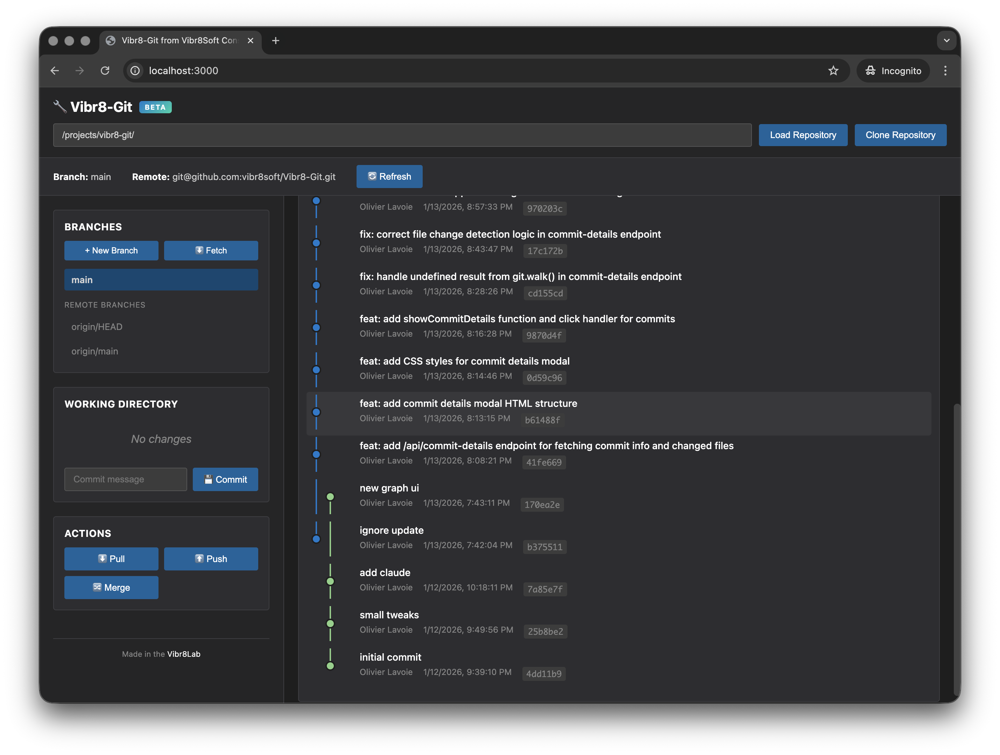
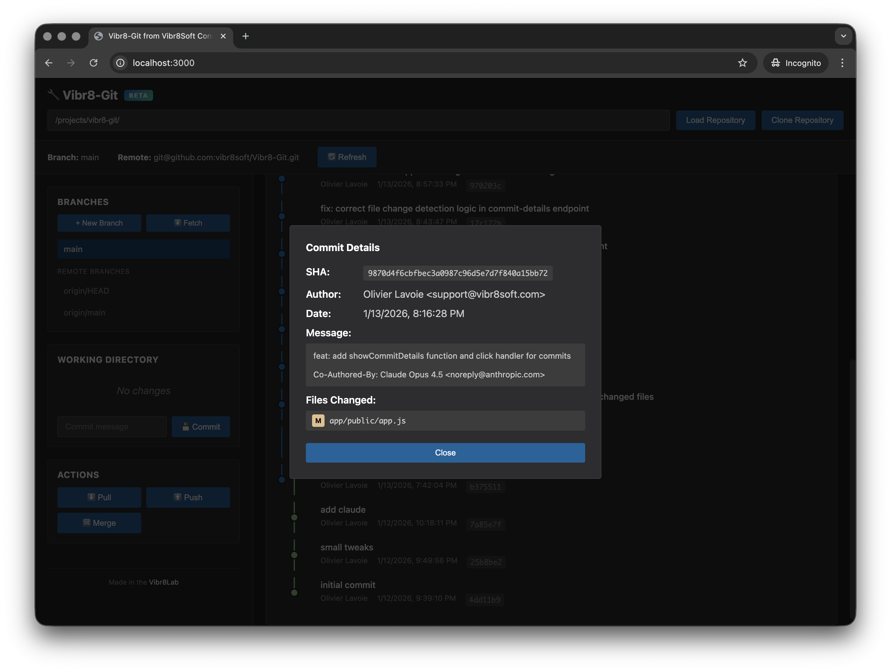

# Vibr8-Git

A portable, browser-based Git client with a visual commit graph. Built with Node.js and isomorphic-git - no git.exe required.

## Screenshots





## Features

### Repository Management
- **Load Repository** - Open any local Git repository by entering its path
- **Clone Repository** - Clone remote repositories with optional authentication

### Branch Operations
- **View Branches** - See all local and remote branches
- **Create Branch** - Create new branches with optional auto-checkout
- **Switch Branch** - Click any branch to check it out
- **Delete Branch** - Remove local branches
- **Merge Branch** - Merge another branch into the current one

### Working Directory
- **File Status** - View modified, added, deleted, and untracked files
- **Stage Files** - Add individual files to the staging area
- **Unstage Files** - Remove files from the staging area
- **Commit Changes** - Create commits with custom messages

### Remote Operations
- **Fetch** - Download updates from remote without merging
- **Pull** - Fetch and merge remote changes
- **Push** - Upload local commits to remote
- Supports HTTPS authentication with username/password or personal access tokens

### Visual Commit Graph
- **Interactive Graph** - Visual representation of commit history with branch lanes
- **Configurable Depth** - View 10 to 500 commits
- **Branch Labels** - See which branches point to each commit
- **Commit Details** - Click any commit to view:
  - Full SHA hash
  - Author name and email
  - Commit date
  - Complete commit message
  - List of changed files with status (Added/Modified/Deleted)

## How to Use

### Starting the Application

1. Open a terminal in the `app` folder
2. Install dependencies (first time only):
   ```bash
   npm install
   ```
3. Start the server:
   ```bash
   node server.js
   ```
4. Open your browser to: `http://localhost:3000`

### Loading a Repository

1. Enter the full path to your repository in the text field
   - Windows: `C:\Users\YourName\Projects\my-repo`
   - Mac/Linux: `/home/yourname/projects/my-repo`
2. Click **Load Repository**

### Making Changes

1. Edit files in your repository using any editor
2. Click **Refresh** to see changes in the Working Directory section
3. Click **Stage** next to files you want to commit
4. Enter a commit message
5. Click **Commit**

### Pushing to Remote

1. Click **Push** to upload commits
2. If prompted, enter your credentials:
   - For GitHub: use your username and a Personal Access Token (not your password)

### Viewing Commit Details

1. Click on any commit in the graph on the right side
2. A modal will show the full commit information including all changed files

## Configuration

### Author Settings
Your name and email for commits are stored in your browser's local storage. They will be requested when you make your first commit.

### Port
The server runs on port 3000 by default. To change it, edit `server.js` line 8:
```javascript
const PORT = 3000;
```

## Requirements

- Node.js 16 or higher
- A modern web browser (Chrome, Firefox, Edge, Safari)

## Limitations

- Single repository at a time
- No SSH authentication (use HTTPS)
- No GPG signing
- Limited merge conflict resolution (manual editing required)
- No Git LFS support
- No submodule support
